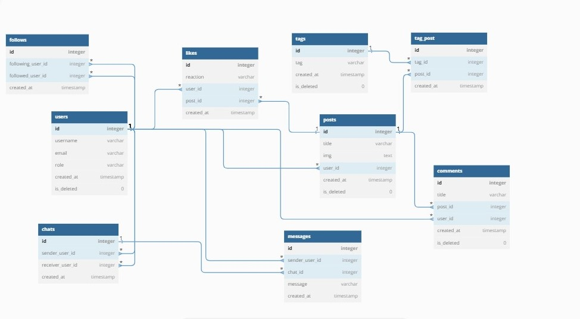

<p align="center">
<a href="https://www.meraki-academy.org" target="_blank" rel="noopener noreferrer">
 
 </a>
</p>

<h3 align="center">SnapFeed
</h3>

---

<p align="center"> Record your unique moment and share it with your community here is your place .
    <br> 
<a href=''>Demo Link</a>
    <br> 
</p>

## 📝 Table of Contents

- [About](#about)
- [Getting Started](#getting_started)
- [Usage](#usage)
- [Built Using](#built_using)
- [User Story](#user_story)
- [Data Flow](#data_flow)
- [Guided By](#guided_by)

## 🧐 About <a name = "about"></a>

It is wonderful to immortalize the moments that we live and share them with those we love if you want an easy and unique way to do all that and more. SnapFeed is the most suitable application for all of that, as it allows you to share moments of joy and pleasure and share them with others. It also allows you to send instant messages to people with whom you have a relationship and communicate with them. 
SnapFeed, with its unique features, includes a simple design to ensure the best user experience.

## 🏁 Getting Started <a name = "getting_started"></a>

These instructions will get you a copy of the project up and running on your local machine for development and testing purposes.

### Prerequisites

- Visual Studio Code follow this <a href=''>link</a> to install.
- Git Bash follow this <a href=''>link</a> to install.
- MongoDB follow this <a href=''>link</a> to install.
- Node.js follow this <a href=''>link</a> to install.

### Installing:

1. Clone the repo to your local machine using git bash.

```
git clone https://github.com/AhmadTIsmail/MERAKI_Academy_Project_5.git
```

2. Install packeges repeat this step in backend and frontend folder

```
npm i
```

3. Run server using git bash inside backend folder

```
npm run dev
```

4. Run application using git bash inside frontend folder

```
npm run start
```

Now app ready to use

## 🎈 Usage <a name="usage"></a>

Use this space to show useful examples of how a project can be used. Additional screenshots, code examples and demos work well in this space. 

Ex.

- You have to register to navigate our web app.
- You can click on the Snapchat icon **location logo** in the navigation bar to go to the home page.
- By clicking on your personal account picture available in the navigation bar, you can either enter the dashboard page or profile page.
-With the search box on the navigation bar, you can search for other users and access their personal profile .
- On the home page, you will find the posts of the people you follow, in addition to your posts. You can add a comment on any of the posts and add a like.
- On the personal page, the user can modify all personal information, and he will see the number of people who follow him and follow them, in addition to the user's posts. This page also enables the user to view all followers and following and navigate to their pages.
- The dashboard page is visible to the admin only and contains statistics and some features that the admin can do.


## ⛏️ Built Using <a name = "built_using"></a>

- [MongoDB](https://www.mongodb.com/) - Database
- [Express JS](https://expressjs.com/) - Server Framework
- [React JS](https://https://reactjs.org/) - Web Framework
- [Node JS](https://nodejs.org/en/) - Server Environment
- [postgresql](https://www.postgresql.org/) - Database


## User Story <a name = "#user_story"></a>

trello board link
<a href='https://trello.com/b/cXaFlvWN/project-5'>Trello</a>

## Data Flow <a name = "#data_flow"></a>

</a>
</br>
data_flow <a href='https://dbdiagram.io/d/642ca1af5758ac5f1726c444'>Link</a>

## ⚠️ Guided By <a name = "guided_by"></a>

This project is guided by ©️ **[berserkers_team](https://github.com/AhmadTIsmail/MERAKI_Academy_Project_5)**